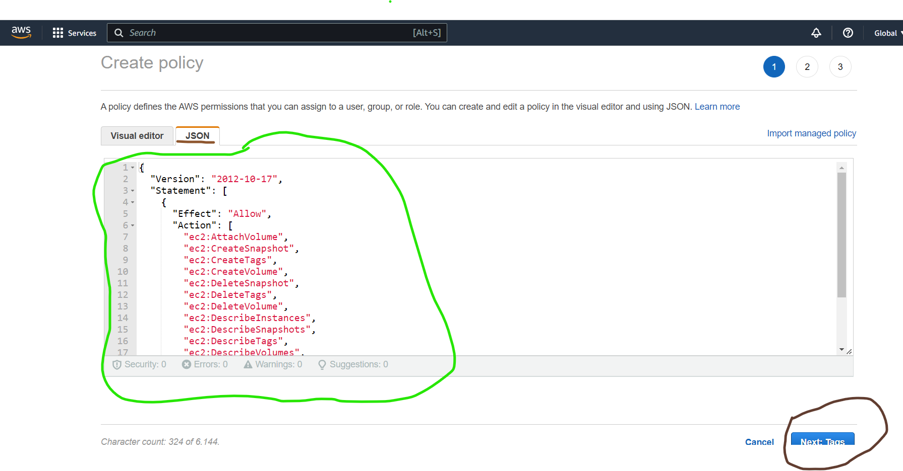
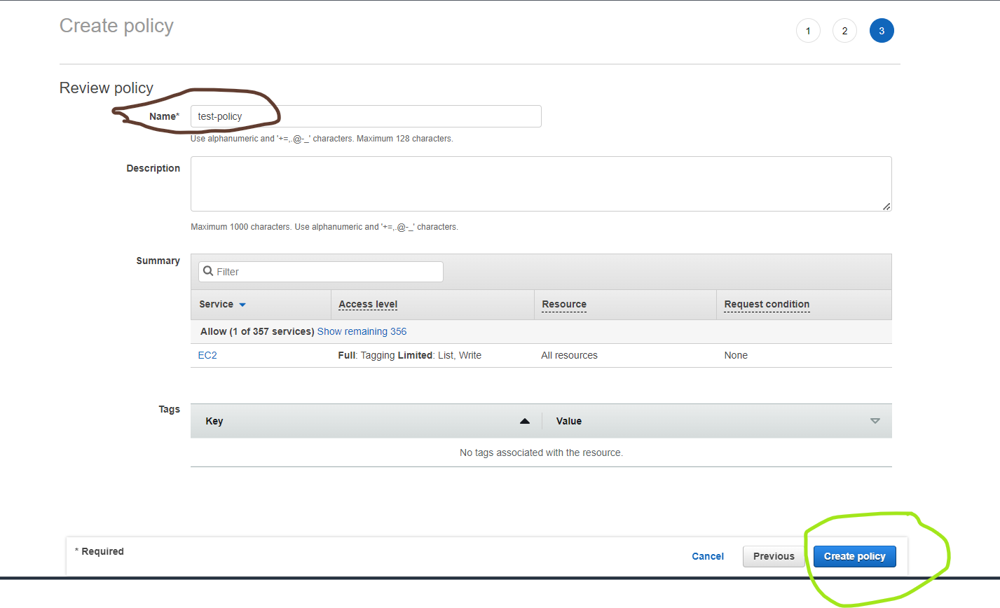
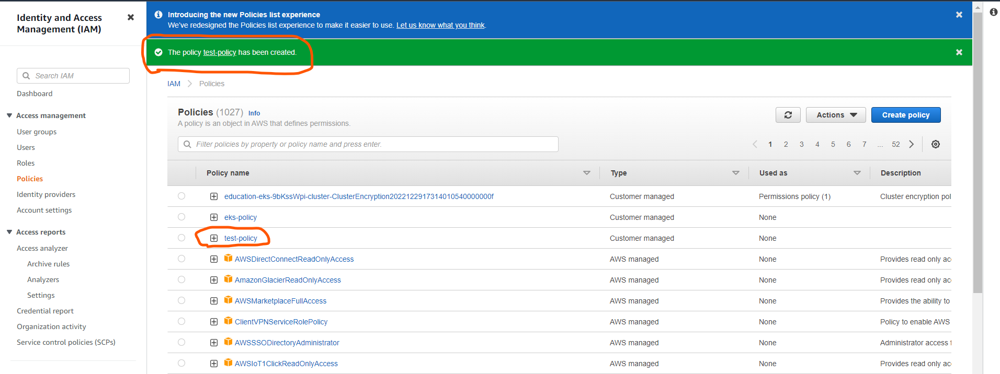

## Installing 'CSI' driver in EKS('Elastic Kubernetes Service'):
----------------------------------------------------------------
[Refer Here](https://www.stacksimplify.com/aws-eks/kubernetes-storage/create-kubernetes-storageclass-persistentvolumeclain-configmap-for-mysql-database/) for the documentation which i followed for the installation of CSI driver in EKS.

* Navigate to 'Install EBS CSI Driver' in the above reference and follow the procedure.

* Create an IAM policy and attach it the nodes of eks(attach to role).
    * Role is the policy which we gives the permissions for one AWS service to access another AWS service.
* Policy to be used
```json
{
  "Version": "2012-10-17",
  "Statement": [
    {
      "Effect": "Allow",
      "Action": [
        "ec2:AttachVolume",
        "ec2:CreateSnapshot",
        "ec2:CreateTags",
        "ec2:CreateVolume",
        "ec2:DeleteSnapshot",
        "ec2:DeleteTags",
        "ec2:DeleteVolume",
        "ec2:DescribeInstances",
        "ec2:DescribeSnapshots",
        "ec2:DescribeTags",
        "ec2:DescribeVolumes",
        "ec2:DetachVolume"
      ],
      "Resource": "*"
    }
  ]
}
```  
* cretae the policy and attach it
   * for creating the policy we use IAM service in AWS


NOw give a name to the policy and create the policy


* Then get the arn of each node using `kubectl -n kube-system describe configmap aws-auth` and attach the policy to the respected arn of the nodes.
* 
