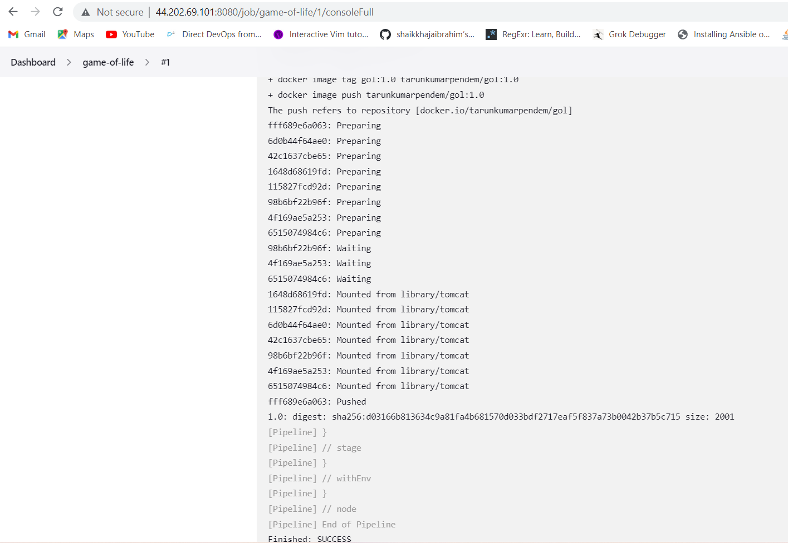
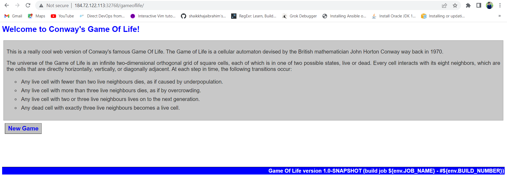
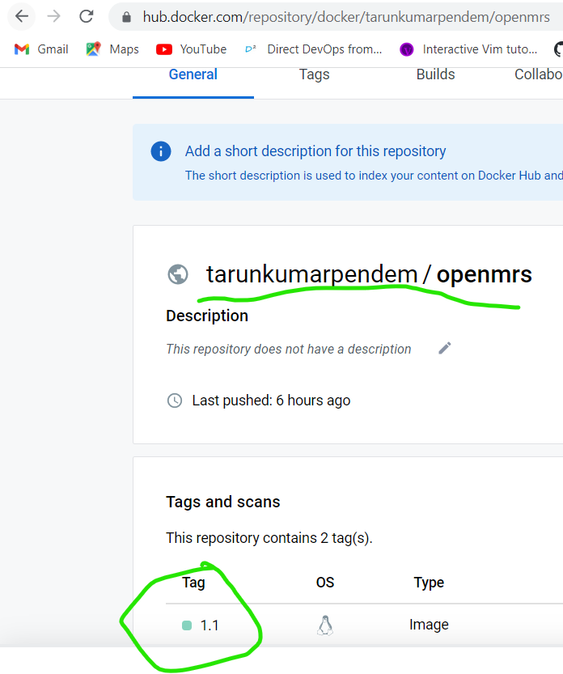

### Game of life:
-----------------
* First of all i created a docker image for gameoflife application and created a tag for the image which i build to push it to registry and then pushed the image to dockerhub registry from Jenkins and i have written Dockerfile to build the image
```Dockerfile
FROM tomcat:8-jdk8 as tarun
RUN apt update \
    && apt install maven git -y \ 
    && git clone https://github.com/wakaleo/game-of-life.git \
    && cd game-of-life \
    && mvn clean install \
    && cp /usr/local/tomcat/game-of-life/gameoflife-web/target/gameoflife.war /usr/local/tomcat/webapps/gameoflife.war 
EXPOSE 8080
CMD [ "catalina.sh", "run" ]    
```

```groovy
pipeline{
    agent{
        label 'node-1'
    }
    stages{
        stage('clone'){
            steps{
                sh """
                      docker image build -t gol:1.0 .
                      docker image tag gol:1.0 tarunkumarpendem/gol:1.0
                      docker image push tarunkumarpendem/gol:1.0
                    """   
            }
        }
    }
}
```


* After the successful containarization of  the application manually.

  
* Then i tried deploy the applcation from kubernetes(K8s) For that we need to write the manifests

The manifest written to deploy game of life:
--------------------------------------------
```yaml
---
apiVersion: apps/v1
kind: Deployment
metadata:
  name: game-of-life
  labels:
    name: gameoflife
    version: jdk8
spec:
  minReadySeconds: 5
  replicas: 3
  selector:
    matchLabels:
      name: gameoflife
  strategy:
    type: RollingUpdate
    rollingUpdate:
      maxSurge: 25%
      maxUnavailable: 25%
  template:
    metadata:
      name: game-of-life
      labels:
        name: gameoflife
        version: jdk8
    spec:
      containers:
        - image: tarunkumarpendem/gol:1.0 
          name: game-of-life
          ports:
            - containerPort: 8080
              protocol: TCP
```
* To access the application within/outside of the K8s cluster we need write the K8s workload service
  
The manifest written for gameoflife service:
-------------------------------------
```yaml
---
apiVersion: v1
kind: Service
metadata: 
  name: gameoflife-svc
  labels:
    app: gameoflife
spec:
  type: LoadBalancer
  selector:
    app: gameoflife
  ports:
    - port: 8080
      name: gameoflife-webport
      targetPort: 8080
``` 
* Then appply these yaml files to create deployments and services from K8s cluster


* Then we can access the application with the dns name of the load balancer which is created from the service manifest which we written


### SpringPetClinic:
--------------------
* First of all i created a docker image for springpetclinic application and created a tag for the image which i build to push it to registry and then pushed the image to dockerhub registry from Jenkins and i have written Dockerfile to build the image
```Dockerfile
FROM amazoncorretto:11
ADD https://referenceapplicationskhaja.s3.us-west-2.amazonaws.com/spring-petclinic-2.4.2.jar .
EXPOSE 8080
CMD ["java", "-jar", "/spring-petclinic-2.4.2.jar"]    
```

```groovy
pipeline{
    agent{
        label 'node-1'
    }
    stages{
        stage('clone'){
            steps{
                git url: 'https://github.com/tarunkumarpendem/spring-petclinic.git',
                    branch: 'main'
            }
        }
        stage('build and push'){
            steps{
                sh """
                      docker image build -t spc:1.0 .
                      docker image tag spc:1.0 tarunkumarpendem/spc:1.0
                      docker image push tarunkumarpendem/spc:1.0
                    """  
            }
        }
    }
}
```


* After the successful containarization of  the application manually.

  
* Then i tried deploy the applcation from kubernetes(K8s) For that we need to write the manifests

The manifest written to deploy Spring-Petclinic:
--------------------------------------------
```yaml
---
apiVersion: apps/v1
kind: Deployment
metadata:
  name: spring-petclinic
  labels:
    name: spring-petclinic
spec:
  minReadySeconds: 5
  replicas: 1
  selector:
    matchLabels:
      name: spring-petclinic
  strategy:
    type: RollingUpdate
    rollingUpdate:
      maxSurge: 25%
      maxUnavailable: 25%
  template:
    metadata: 
      name: spring-petclinic
      labels:
        name: spring-petclinic
    spec:
      containers:
        - image: tarunkumarpendem/spc:1.0
          name: spring-petclinic
          ports:
            - containerPort: 8080
              protocol: TCP
```
* To access the application within/outside of the K8s cluster we need write the K8s workload service
  
The manifest written for Spring-petclinic service:
-------------------------------------
```yaml
---
apiVersion: v1
kind: Service
metadata: 
  name: spring-petclinic-svc
  labels:
    app: spring-petclinic
spec:
  type: LoadBalancer
  selector:
    app: spring-petclinic
  ports:
    - port: 8080
      name: spring-petclinic-webport
      targetPort: 8080     
``` 
* Then appply these yaml files to create deployments and services from K8s cluster

* Then we can access the application with the dns name of the load balancer which is created from the service manifest which we written


-----
### Openmrs:
------------
* First of all like game fo life i created a docker image for openmrs application and created a tag for the image which i build to push it to registry and then pushed the image to dockerhub registry from Jenkins and i have written Dockerfile to build the image
```Dockerfile
FROM maven:3-jdk-8 as build
RUN git clone https://github.com/tarunkumarpendem/openmrs-core.git && \
    cd openmrs-core && \
    mvn package

# Dockerfile ,,,Openmrs run i,e stage-2
#war file location: /openmrs-core/webapp/target/openmrs.war
FROM tomcat:8-jdk11
LABEL application="openmrs"
LABEL owner="Tarun"
COPY --from=build /openmrs-core/webapp/target/openmrs.war /usr/local/tomcat/webapps/openmrs.war
EXPOSE 8080
CMD ["catalina.sh", "run"]    
```

```groovy
pipeline{
    agent {
        label 'node-2'
    }
    stages{
        stage('clone'){
            steps{
                sh """
                      docker image build -t openmrs:1.1 .
                      docker image tag openmrs:1.1 tarunkumarpendem/openmrs:1.1
                      docker image push tarunkumarpendem/openmrs:1.1
                    """   
            }
        }
    }
}
```


* After the successful containarization of  the application manually.

  
* Then i tried deploy the applcation from kubernetes(K8s) For that we need to write the manifests a database deployment and service is also requied (but not nescessary to run this application) for this openmrs and for database it generally has a volume for that i created a PersistentVolumeClaims and attached it to mysql database 

The manifest written to deploy openmrs:
--------------------------------------------
```yaml
---
apiVersion: apps/v1
kind: Deployment
metadata:
  name: openmrs
  labels:
    name: openmrs
spec:
  minReadySeconds: 5
  replicas: 3
  selector:
    matchLabels:
      name: openmrs
  strategy:
    type: RollingUpdate
    rollingUpdate:
      maxSurge: 25%
      maxUnavailable: 25%
  template:
    metadata:
      name: openmrs
      labels:
        name: openmrs
    spec:
      containers:
        - image: tarunkumarpendem/openmrs:1.1 
          name: openmrs
          ports:
            - containerPort: 8080
              protocol: TCP
```
* To access the application within/outside of the K8s cluster we need write the K8s workload service
  
The manifest written for openmrs service:
-------------------------------------
```yaml
---
apiVersion: v1
kind: Service
metadata: 
  name: openmrs-svc
  labels:
    app: openmrs
    type: service
spec:
  type: LoadBalancer
  selector:
    name: openmrs
  ports:
    - port: 8080
      name: openmrs-web-port
      targetPort: 8080
``` 

Manifest written to create PersistentVolumeClaim(PVC):
------------------------------------------------------
```yaml
---
apiVersion: v1
kind: PersistentVolumeClaim
metadata:
  name: openmrs-pvc
  labels:
    app: openmrs
spec:
  selector:
    matchLabels:
      app: openmrs
  storageClassName: gp2
  accessModes:
    - ReadWriteMany
  volumeName: mysqlvol
  resources:   
    requests:
      storage: 1Gi      
```
Manifest for deploying mysql database:
--------------------------------------
```yaml
---
apiVersion: apps/v1
kind: Deployment
metadata:
  name: mysql-db-deploy
  labels:
    db: mysql
    name: mysql-db-deploy
spec:
  minReadySeconds: 10
  replicas: 1
  selector:
    matchLabels:
      name: mysql-db-deploy
  strategy:
    type: RollingUpdate
    rollingUpdate:
      maxSurge: 25%
      maxUnavailable: 25%
  template:
    metadata:
      name: mysql-db-deploy
      labels:
        db: mysql
        name: mysql-db-deploy
    spec:
      containers:
        - image: mysql:8.0.31-debian
          name: mysql-db 
          ports:
            - containerPort: 3306
              protocol: TCP
          volumeMounts:
            - mountPath: /var/lib/mysql
              name: mysql-pvc-vol
      volumes: 
        - name: mysql-pvc-vol
          persistentVolumeClaim: 
            claimName: openmrs-pvc                  
```

Manifest written for mysql database service but here it (mysql-db) doesn't need to expose to outside world(outside of K8s Cluster) so we can use ClusterIp type
```yaml
---
apiVersion: v1
kind: Service
metadata: 
  name: mysql-svc
  labels:
    db: mysql
    type: service
spec:
  type: ClusterIP
  selector:
    db: mysql
    name: mysql-db-deploy
  ports:
    - port: 3306
      name: mysql-port
      targetPort: 3306
```
* Then appply these yaml files to create Deployments, Volumes and Services from K8s cluster


* Then we can access the application with the dns name of the load balancer which is created from the service manifest which we written


### K8s Ingress workload:
-------------------------
* Ingress:
      *  When we need path based or hostname based routing we can use ingress
      *  Ingress supports layer7 lb with in k8s cluster but to expose this functionality outside of k8s cluster it needs ingress controller

Manifest written to create Ingress for openmrs and game of life applications:
------------------------------------------------------------------------------
```yaml
---
apiVersion: apps/v1
metadata:
  name: game-of-life-deploy
  labels: 
    app1: game-of-life-deploy
kind: Deployment
spec:
  minReadySeconds: 3
  replicas: 1
  selector:
    matchLabels:
      app1: game-of-life-deploy
  strategy:
    type: RollingUpdate
    rollingUpdate:
      maxSurge: 25%
      maxUnavailable: 25%
  template:
    metadata:
      name: game-of-life-deploy
      labels:
        app1: game-of-life-deploy
    spec:
      containers:
        - image: tarunkumarpendem/gol:1.0
          name: game-of-life
          ports:
            - containerPort: 8080
              protocol: TCP

---
apiVersion: apps/v1
metadata:
  name: openmrs-deploy 
  labels: 
    app2: openmrs-deploy
kind: Deployment
spec:
  minReadySeconds: 3
  replicas: 1
  selector:
    matchLabels:
      app2: openmrs-deploy
  strategy:
    type: RollingUpdate
    rollingUpdate:
      maxSurge: 25%
      maxUnavailable: 25%
  template:
    metadata:
      name: openmrs-deploy
      labels:
        app2: openmrs-deploy
    spec:
      containers:
        - image: tarunkumarpendem/openmrs:1.1
          name: openmrs
          ports:
            - containerPort: 8080
              protocol: TCP              
        


---
apiVersion: v1
kind: Service
metadata:
  name: apps-svc
  labels:
    name: apps-svc
spec:
  ports:
    - port: 20000
      targetPort: 8080
      protocol: TCP
      name: apps-webport-1
    - port: 10000
      targetPort: 8080
      protocol: TCP
      name: apps-webport-2  
  selector:
    app1: game-of-life-deploy 
    app2: openmrs-deploy
  type: LoadBalancer  


---
apiVersion: networking.k8s.io/v1
kind: Ingress
metadata:
  name: ingress
  annotations:
    kubernetes.io/ingress.class: service.beta.kubernetes.io/aws-load-balancer-healthcheck-path
spec:
  rules:
    - http:
        paths:
          - path: /gameoflife
            backend:
              service:
                name: apps-svc
                port:
                  number: 20000
            pathType: Exact
          - path: /openmrs
            backend:
              service:
                name: apps-svc
                port:
                  number: 10000
            pathType: Exact               
```
* Apply the manifest and check for workloads it created

* Try to access the applications

Here ingress is created but it doesn't gave ExternalIp which i need to clarify

Errors:
-------
The following error in the EKS is getting repeated again and again which need to be fixed but the probelm is even though the instances are running fine and load balancers getting created but still the instances attached to load balancers are in OutOfService state which should be cleared
 


Because of the above error i'm getting till only this 
